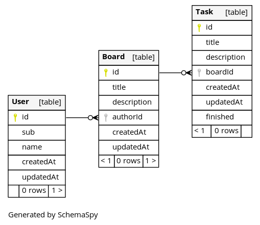
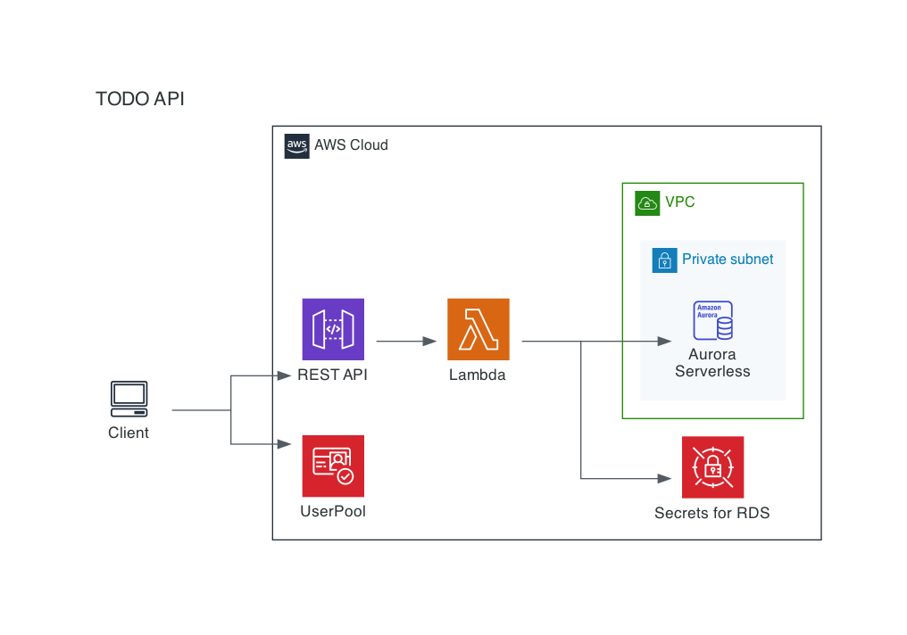

# todo-api

## 各種手順

- [ローカル環境のセットアップ](./docs/setup-local.md)
- [AWS 環境のセットアップ](./docs/setup-infrastructure.md)
- [アプリケーションのデプロイ](./docs/deploy.md)

## 設計

### API 仕様書

[API 仕様書](./docs/api.md)

### ER 図



更新するときは以下を実行する

```sh
docker run -v $PWD/schemaspy:/output --net=host schemaspy/schemaspy:6.1.0 -t mysql -host localhost:53306 -db tadb -u tauser -p password -connprops useSSL\\\\=false -all
```

### CRUD

|                                             | User | Board | Task |
| ------------------------------------------- | ---- | ----- | ---- |
| GET `/user`                                 | R    | R     |      |
| POST `/user`                                | C    | C     | C    |
| PUT `/user`                                 | U    |       |      |
| POST `/board`                               |      | C     |      |
| PUT `/board/:boardId`                       |      | U     |      |
| DELETE `/board/:boardId`                    |      | D     |      |
| GET `/board/:boardId/tasks`                 |      |       | R    |
| POST `/board/:boardId/task`                 |      |       | C    |
| PUT `/board/:boardId/task/:taskId`          |      |       | U    |
| DELETE `/board/:boardId/task/:taskId`       |      |       | D    |
| PUT `/board/:boardId/task/:taskId/finished` |      |       | U    |

- Cognito UserPool のアカウントと User は別々に作成する
- Board 一覧をトップで表示するために GET `/user` は Board を含めて返す
- サンプルとしての Board と Task を表示するために POST `/user` は Board と Task も作成する
- アカウントと User の削除について、要件を出し切れていない。。。

### 構成図



## load map

1. architecture overview
   - [x] base of cdk
   - [x] deploy all resourse
   - [x] integration
   - [x] db migration pipline
1. rest server on local
   - [x] setup prisma
     - https://www.prisma.io/docs/getting-started/setup-prisma/start-from-scratch-typescript-postgres
     - https://www.prisma.io/docs/concepts/components/prisma-migrate/shadow-database
     - https://www.prisma.io/docs/guides/performance-and-optimization/connection-management
   - [x] setup express
   - [x] express on lambda
   - [x] restful api
     - [x] search tasks
     - [x] the others
1. integration
   - [x] e2e test
   - [x] documentation
1. definition of done
   - [x] design of architecture
   - [x] documentation of design
   - [x] implimentation
   - [x] test code
   - [x] playbook for launching application
1. タスク
   - [x] Cognito 込みでテストできる画面
   - [x] User の createdAt と updatedAt 忘れてた
   - [x] アーキテクチャの文書化
   - [x] simulator の整備
   - [x] インフラ構築動作確認の手順
   - [x] [setup-local](./docs/setup-local.md)が多分足りてない。やってみる。
   - [x] DB Index
   - API インターフェースの見直しと文書化
     - [x] 入力チェック見直し
       - 最大文字数
       - 有効文字
       - サニタイズ
     - [x] テスト: status の expext を追加
     - [ ] エラーレスポンスの統一
     - [ ] エラーレスポンスの文書化
   - 実装の見直し
     - [x] トランザクション見直し
   - 運用
     - [ ] ログ設計
     - [x] nat 落とす
     - [x] CI
     - [ ] CD
     - [x] lambda insight
     - [ ] synthetics monitor
   - 内部品質
     - [ ] Migrater の応答がエラーになっている
     - [x] テストの文言
     - [x] テストしやすい docker compose 環境
     - [x] カバレッジ取る
     - [ ] use https://middy.js.org/
   - 機能
     - [x] done API
     - [x] 検索強化
     - [ ] 変更履歴
     - [ ] 楽観ロック
     - [ ] init via Cognito Sign Up
